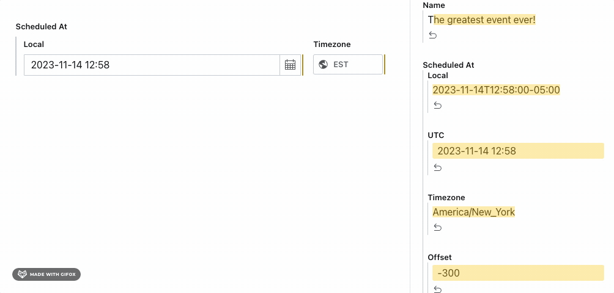

> This is a **Sanity Studio v3** plugin.
> For the v2 version, please refer to the [studio-v2 branch](https://github.com/sanity-io/rich-date-input/tree/studio-v2).

# V3 Rich Date Input

Provides a timezone-aware date input for Sanity Studio.



## Installation

```sh
npm install @sanity/rich-date-input
```

## Usage

Add it as a plugin in `sanity.config.ts` (or .js):

```ts
import {defineConfig} from 'sanity'
import {richDate} from '@sanity/rich-date-input'

export default defineConfig({
  //...
  plugins: [richDate()],
})
```

Then, use `richDate` as a type in your schema:

```ts
import {defineField, defineType} from 'sanity'

export default defineType({
  name: 'event',
  title: 'Event',
  type: 'document',
  fields: [
    def{
      name: 'scheduledAt',
      title: 'Scheduled at',
      type: 'richDate',
      //this will take the same options available on the datetime type: https://www.sanity.io/docs/datetime-type
      options: {
        timeStep: 30
      }
    },
  ],
})
```

When a user selects a date, the timezone will be stored in the document. They can choose a different timezone, if desired. The date displayed will be the time as it would be in that timezone. UTC will be calculated from the timezone and local time.

The typical data output should be:

```ts
{
  _type: 'richDate',
  local: '2023-02-21T10:15:00+01:00',
  utc: '2023-02-12T09:15:00Z',
  timezone: 'Europe/Oslo',
  offset: 60
}
```

## License

[MIT](LICENSE) © Sanity.io

## Develop & test

This plugin uses [@sanity/plugin-kit](https://github.com/sanity-io/plugin-kit)
with default configuration for build & watch scripts.

See [Testing a plugin in Sanity Studio](https://github.com/sanity-io/plugin-kit#testing-a-plugin-in-sanity-studio)
on how to run this plugin with hotreload in the studio.

### Release new version

Run ["CI & Release" workflow](https://github.com/sanity-io/v3-rich-date-input/actions/workflows/main.yml).
Make sure to select the main branch and check "Release new version".

Semantic release will only release on configured branches, so it is safe to run release on any branch.
